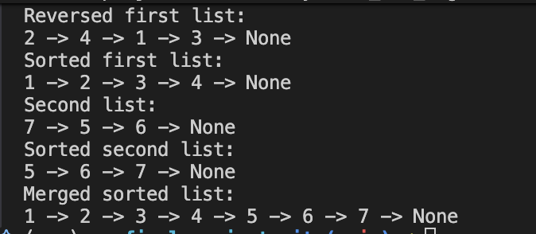
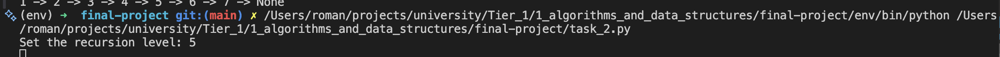
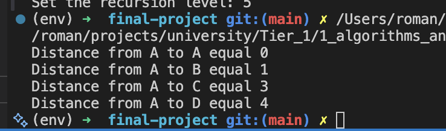
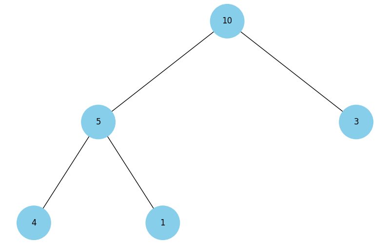
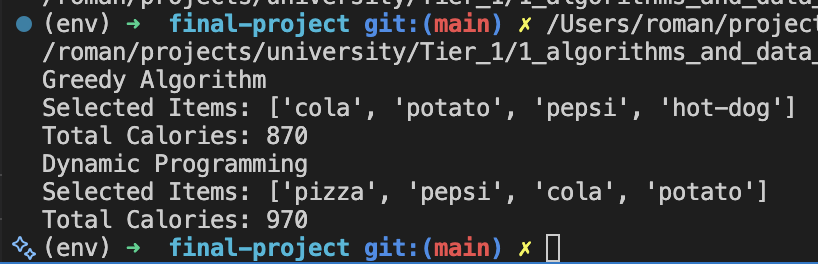
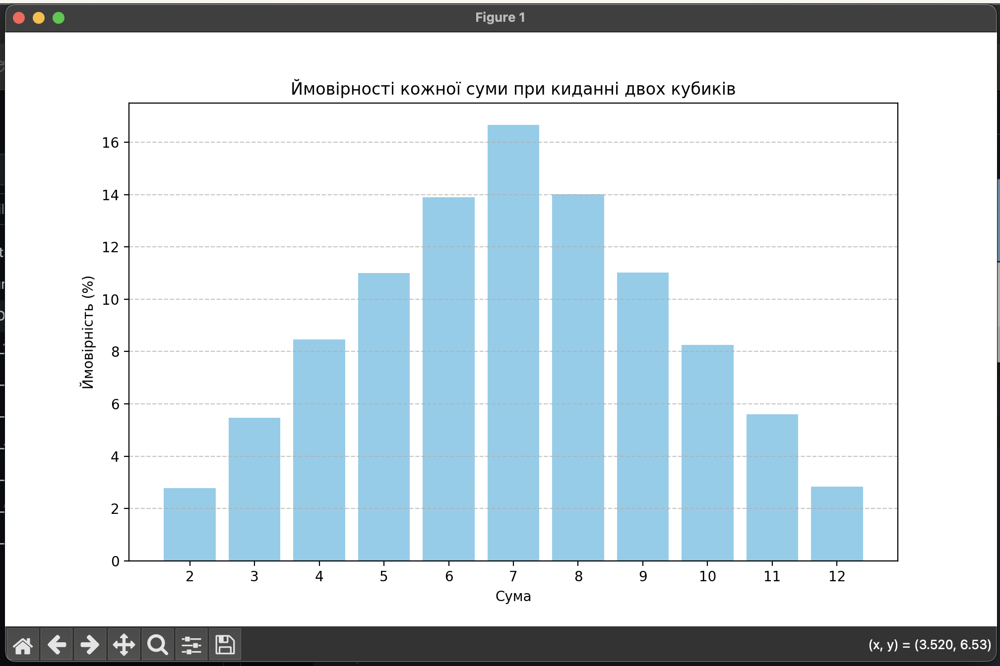
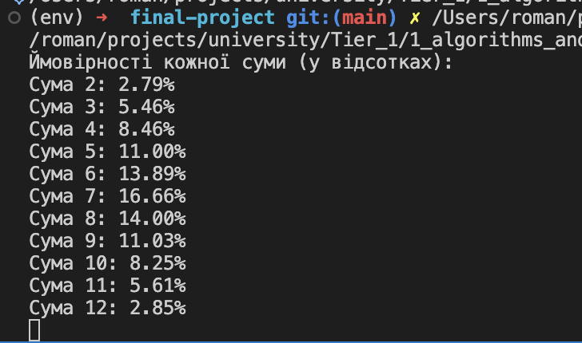

# goit-algo-fp

## Завдання 1:

1. **Реверсування списку:**
   Функція `reverse_linked_list` змінює посилання між вузлами списку таким чином, що останній вузол стає першим, передостанній — другим і т.д..
2. **Сортування вставками:**
   Алгоритм сортування вставками поступово бере елементи з початкового списку і вставляє їх у правильному порядку в новий відсортований список.
3. **Об'єднання двох відсортованих списків:**
   Функція `merge_sorted_lists` об'єднує два відсортовані списки, створюючи новий відсортований список шляхом порівняння та злиття елементів обох списків.

## Завдання 2:

## Завдання 3:

## Завдання 4:

## Завдання 5:

## Завдання 6:

1. **Жадібний алгоритм:**
   Функція `greedy_algorithm()` вибирає страви з максимальним співвідношенням калорій до вартості в межах бюджету.

2. **Динамічне програмування:**
   Функція `dynamic_programming()` обчислює оптимальний набір страв для максимізації калорійності при заданому бюджеті.

## Завдання 7:

### Порівняння ймовірностей кидання двох кубиків

У цій таблиці представлені ймовірності для кожної суми, отримані за допомогою методу Монте-Карло, а також аналітичні розрахунки ймовірностей. Вказано також відхилення між обчисленими ймовірностями.

| Сума | Ймовірність (Метод Монте-Карло) | Ймовірність (Аналітична) | Відхилення (%) |
| ---- | ------------------------------- | ------------------------ | -------------- |
| 2    | 2.79%                           | 2.71%                    | +0.08%         |
| 3    | 5.46%                           | 5.38%                    | +0.08%         |
| 4    | 8.46%                           | 8.37%                    | +0.09%         |
| 5    | 11.00%                          | 10.87%                   | +0.13%         |
| 6    | 13.89%                          | 13.82%                   | +0.07%         |
| 7    | 16.66%                          | 16.59%                   | +0.07%         |
| 8    | 14.00%                          | 13.99%                   | +0.01%         |
| 9    | 11.03%                          | 11.00%                   | +0.03%         |
| 10   | 8.25%                           | 8.20%                    | +0.05%         |
| 11   | 5.61%                           | 5.57%                    | +0.04%         |
| 12   | 2.85%                           | 2.76%                    | +0.09%         |

### Аналіз Результатів

1. **Точність Монте-Карло**:

   - Відхилення між ймовірностями, отриманими за допомогою методу Монте-Карло, та аналітичними розрахунками є незначним. Відхилення варіюється від +0.01% до +0.13%, що свідчить про точність методу Монте-Карло при великій кількості симуляцій.

2. **Відповідність**:

   - Результати методу Монте-Карло в основному відповідають аналітичним розрахункам, з незначними відхиленнями. Це підтверджує правильність симуляцій і те, що використані симуляції були достатньо великі, щоб наблизитися до аналітичних результатів.

3. **Природа Відхилень**:
   - Незначні відхилення можуть бути зумовлені випадковим характером симуляцій, і вони є нормальною частиною використання методу Монте-Карло. Більше симуляцій могли б зменшити ці відхилення, проте з практичної точки зору результати вже досить близькі до аналітичних значень.

### Висновок

Отримані результати за допомогою методу Монте-Карло дуже близькі до аналітичних значень, що підтверджує ефективність і точність симуляцій при достатньо великій кількості ітерацій. Це демонструє, що метод Монте-Карло може бути надійним інструментом для оцінки ймовірностей у випадкових процесах, таких як кидання кубиків.

